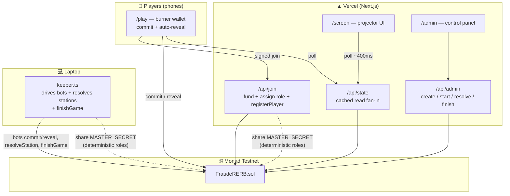

# 🚇 Fraude sur le RER B

**A fully on-chain social-deduction party game — built for Monad Blitz Paris.**
The whole room boards the same RER B train from Robinson to Aéroport CDG. At every station each
passenger secretly picks a **car** and either **PAYER** (buy a ticket, −2 pts) or **FRAUDER**
(free). Hidden **CONTRÔLEURS** secretly inspect one car — fraudsters caught there pay a **20 pt
fine**, split among the inspectors of that car. Roles stay hidden on-chain until the terminus.

> *« Payez votre ticket ou fraudez. Des contrôleurs se cachent parmi vous. Fraudeur contrôlé = 20 points d'amende. »*

Points are **in-game only** (everyone starts at 100). No money, no gambling — just pride and shame.

- 📱 **Zero-friction:** scan a QR → type a pseudo → playing. A burner wallet is generated on the
  phone and auto-funded; there is no MetaMask, no network switch, no faucet.
- ⏱️ **One tap per station:** choose a car + action; the reveal is sent automatically by the phone.
- 🤖 **Bots** fill the train to 20 passengers so it works with few humans (and a solo demo mode).
- 🖥️ A **big-screen** projector view animates the whole thing: gliding train, contrôleur
  silhouettes, `AMENDE −20` rubber stamps, live leaderboard, awards + role unmasking.

---

## Why Monad

The game only works if **dozens of people take an action every ~20 seconds and see the result
instantly.** That's a burst of 20–60+ transactions per station (commits, reveals, resolution),
repeated every round. Monad's **sub-second blocks and high throughput** make that burst clear well
inside a 12 s commit window, so the round feels live rather than laggy. On a slower chain the
"everyone plays at once" mechanic simply falls apart. Cheap gas also means auto-funding every
player's burner and covering their txs costs almost nothing.

---

## Hidden roles on a public chain (the interesting part)

Roles must **not** be readable on-chain while the game is running, yet everything must be
verifiable afterwards. We use a two-layer commit-reveal:

**1. Role commitment (at registration).** The Game Master stores only
```
roleCommit[player] = keccak256(abi.encode(player, role, roleSalt, gameId))
```
The plaintext `role` + `roleSalt` are derived **deterministically** from a shared `MASTER_SECRET`:
```
role     = keccak256("RERB_ROLE",      gameId, player, MASTER_SECRET) % ROLE_DENOM == 0 ? CONTRÔLEUR : PASSAGER
roleSalt = keccak256("RERB_ROLE_SALT", gameId, player, MASTER_SECRET)
```
Both the Vercel backend (`/api/join`) and the laptop keeper know `MASTER_SECRET`, so they can
**assign a role at join time and reconstruct every role+salt at the end with zero shared database.**

**2. Per-station choice commitment.** Every player — passenger or contrôleur — commits the same
shape, so commits are indistinguishable:
```
h = keccak256(abi.encode(car, action, salt, player, stationIndex))
```
Passengers use `action ∈ {PAY, FRAUD}`; contrôleurs use `action = INSPECT` with `car` = the
inspected car. On reveal, a contrôleur additionally supplies `roleSalt`, and the contract checks it
against `roleCommit` — **a passenger literally cannot fake an inspection.**

At `finishGame`, the GM submits every `(role, roleSalt)`; the contract verifies each against
`roleCommit` and publishes the roles, so the whole game is provably fair.

**Known limitation (future work):** after a contrôleur's first `reveal`, a motivated person decoding
transaction calldata could learn that address is a contrôleur. The UI never shows roles before the
end, but the calldata is public. A ZK role proof (prove "I am a contrôleur" without revealing which
commitment) would close this. Similarly, a contrôleur who fails to auto-reveal is treated as a
fraudster — the phone auto-reveals to avoid this.

---

## Architecture



Phases per station are a **deterministic schedule** fixed at `startGame`: `commit (12s) → reveal
(5s) → resolve/animate (3s)`, so every client computes the same countdowns from `block.timestamp`.

- **`contracts/`** — Foundry, `FraudeRERB.sol` (Solidity 0.8.28). 14 tests, `resolveStation` with
  64 players ≈ 222k gas.
- **`keeper/`** — TypeScript + viem. `simulate.ts` (full 20-bot game from the terminal),
  `keeper.ts` (live game driver), `deploy.ts`, `probe.ts` (M0 latency check).
- **`app/`** — Next.js App Router + Tailwind + Framer Motion. `/play`, `/screen`, `/admin`, and the
  `/api/*` routes.
- **`shared/`** — the contract ABI, imported by both keeper and app.

---

## Run it

### 0. Prereqs
- Node 20+, Foundry, a **test** wallet funded with MON from **blitz.devnads.com**.
- `cp .env.example .env` and fill `PRIVATE_KEY`, `MASTER_SECRET`, `ADMIN_SECRET`.

### 1. Contract
```bash
cd contracts && forge test            # 14 tests green
cd ../keeper && npm i && npm run deploy   # writes deployments/monad-testnet.json
# put the address in .env: CONTRACT_ADDRESS + NEXT_PUBLIC_CONTRACT_ADDRESS
```

### 2. Prove the core (no UI needed)
```bash
cd keeper && npm run simulate -- --n 20 --stations 4      # full game in the terminal
# or against a local chain:  anvil --block-time 1 &  then set MONAD_RPC_URL=http://127.0.0.1:8545
```

### 3. App
```bash
cd app && npm i && npm run dev     # http://localhost:3000  (/screen, /play, /admin?secret=...)
```

### 4. Live demo flow
1. Open `/screen` on the projector, `/admin?secret=$ADMIN_SECRET` on your laptop.
2. In `/admin`, **Create** a game (preset *Démo 4·12·5*).
3. Start the keeper to add bots and drive them:
   `cd keeper && npm run keeper` (set `GAME_ID`, `N_BOTS=20`; `AUTOSTART_SECONDS=0` waits for START).
4. The room scans the QR on `/screen` and joins.
5. Press **DÉMARRER** in `/admin`. Enjoy. At CDG: podium, awards, roles unmasked.

**Solo / rehearsal mode:** skip step 4 — just the keeper's bots. A 4-station game runs in ~80 s.

### M0 risk check
`cd keeper && npm run probe -- --n 20` deploys `Ping` and blasts 20 txs; see `NOTES.md` for the
verdict and the fallback ladder (more sender keys → longer commit window → fewer bots).

---

## Deploy to Vercel
Point the project **Root Directory** to `app/`, add the env vars from `.env.example`
(`PRIVATE_KEY`, `MASTER_SECRET`, `ADMIN_SECRET`, `CONTRACT_ADDRESS`, `NEXT_PUBLIC_*`, a good RPC —
an Alchemy Monad key is recommended so 30 phones don't hit the public RPC rate limit), and deploy.
The keeper always runs on your **laptop** (it holds bot keys and resolves stations).

---

## Deployed & live
- **App:** https://monad-blitz-paris.vercel.app  (`/screen`, `/play`, `/admin?secret=…`)
- **Contract (Monad Testnet):** [`0x49b178282ad9e83cc117e0412a5f0ad062f2198a`](https://testnet.monadexplorer.com/address/0x49b178282ad9e83cc117e0412a5f0ad062f2198a)
- Full details in [`deployments/monad-testnet.json`](deployments/monad-testnet.json).

Verified live on Monad Testnet — a full 20-bot × 3-station game ran end-to-end (commit / reveal /
resolve / finish, correct fines, splits, non-revealer handling and role reveal), plus a mixed
human+bot game through the deployed app. See `NOTES.md` for the M0 RPC finding and fix.

## Credits & disclaimer
Parody project. **No official RATP / SNCF / Île-de-France Mobilités logo, font (Parisine) or jingle
is used** — all art, the 3-note chime and the announcements are original. Station names are real;
the branding is ours.
