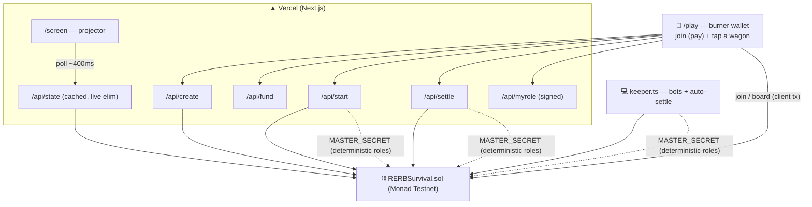

# 🚇 Fraude sur le RER B — édition survie

**A fully on-chain survival party game — built for Monad Blitz Paris.**
Everyone pays a small MON stake to board the same RER B train. Each station you secretly pick a
**wagon**. Hidden **contrôleurs** ride with you — everyone sharing a wagon with a contrôleur is
**eliminated**. Survive to Aéroport CDG and the last passengers **split the whole pot**.

> *Cachez-vous dans le bon wagon. Les contrôleurs rôdent.*

- 📱 **Zero-friction:** open the app → a burner wallet is created and auto-funded → pay the stake → you're in. No MetaMask, no faucet.
- 🎭 **Two roles, nobody knows who:** **fraudeurs** hide, **contrôleurs** hunt. Roles are hidden on-chain until the very end.
- 💰 **Real (testnet) MON pot:** every stake goes in; survivors split it all. Payout is computed and paid **by the contract itself** — trustless.
- 🤖 **Bots** fill the train; a **solo mode** runs a whole game from the terminal.

## Rules
1. The host creates a game: number of **wagons**, **contrôleurs**, and **stations**.
2. Players join (small MON stake). Up to **3 players per wagon** register; a wagon holds **5** at a time (full = locked). A wagon can be empty.
3. On start, exactly *N* players are secretly made contrôleurs (the rest are fraudeurs). Contrôleurs see each other.
4. Each station (≈20 s): everyone taps a wagon. Then the train departs and the wagons with a contrôleur light up — **everyone in them is eliminated**, their stake stays in the pot. A contrôleur who catches nobody **two stations in a row** is eliminated too.
5. Eliminated players keep watching as ghosts. At CDG, **survivors split the pot** and all roles are revealed.

Not boarding in time = you ride in a random wagon (don't miss the train).

## Why Monad
The game only works if dozens of people act every ~20 s and see the result instantly — a burst of
tx per station, every round. Monad's **sub-second blocks + high throughput** make that feel live.
Cheap gas means we can auto-fund every player's burner and cover their txs. Measured on testnet:
individual txs confirm in ~1 block; the only bottleneck was the **public RPC rate limit** on bursts
from one IP (the keeper's bots), solved with a fallback RPC pool + bounded concurrency. See `NOTES.md`.

## Hidden roles + trustless money
- On start, the host stores a **commitment** per player: `roleCommit = keccak256(player, role, salt, gameId)`. Roles/salts are derived deterministically from a shared `MASTER_SECRET`, so the Vercel backend and the laptop keeper agree with **no database**.
- Wagon choices are **public** (that's the visible fill) — but nothing reveals a role.
- At `settle`, the host submits every `(role, salt)`; the contract verifies them against the commitments, **recomputes the entire elimination sequence from the on-chain boarding history**, decides the survivors and **pays the pot**. The game master cannot cheat the payout, and roles stay hidden until the end. Eliminated players' late boardings are ignored by the canonical recomputation (anti-cheat).

Known limitation: the live per-station "who got caught" reveal is computed off-chain by the server (it knows the secret) to drive the animation; the on-chain `settle` is the source of truth for money.

## Architecture


- **`contracts/`** — Foundry, `RERBSurvival.sol` (0.8.28). 11 tests; settle @ 24 players/3 stations ≈ 6.4M gas. (`FraudeRERB.sol` is the earlier points-based prototype, kept for reference.)
- **`keeper/`** — TS + viem: `simulate.ts` (full game from the terminal), `keeper.ts` (bots + auto-settle), `deploy.ts`, `probe.ts`.
- **`app/`** — Next.js App Router + Tailwind + Framer Motion. Hand-drawn riso/screenprint DA (SVG passengers, contrôleur, wagons), chiptune music + French announcements.

## Deployed & live
- **App:** https://monad-blitz-paris.vercel.app  (`/play`, `/screen`)
- **Contract (Monad Testnet):** [`0x450F34a1a3e6Cd3c394F621708F03Ba40E7026ed`](https://testnet.monadexplorer.com/address/0x450F34a1a3e6Cd3c394F621708F03Ba40E7026ed)
- **Game master / filler:** `0x2a9d3d608580df871E86eE1C161f1b5191c1c7Aa` (funds burners + pays gas)

## Run it
```bash
# contract
cd contracts && forge test
cd ../keeper && npm i && npm run deploy        # writes deployments/monad-testnet.json

# full game in the terminal (no UI)
npm run simulate -- --wagons 4 --stations 4 --n 12

# app
cd ../app && npm i && npm run dev               # /play, /screen
```

### Live demo
1. Host opens `/play`, taps **Créer une partie** (wagons / contrôleurs / stations) → auto-joins and gets an **Ouvrir le grand écran** link.
2. Open that `/screen?g=<id>` on the projector — its QR points players straight to that game.
3. Fill with bots from the laptop: `cd keeper && GAME_ID=<id> N_BOTS=12 npm run keeper` (it also auto-settles at the end).
4. Room scans the QR, joins. Host taps **LANCER**. Tap a wagon each station. Survivors split the pot at CDG.

Solo/rehearsal: just the keeper's bots.

## Credits
Parody project — all art, the chiptune and the announcements are original; no official RATP/SNCF/IDFM asset is used.
